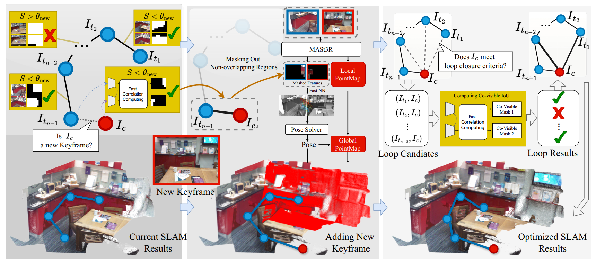

# Sparse View SLAM with Ultrafast Keyframe Selector
### Paper(TODO) | Project Page(TODO)

> Sparse View SLAM with Ultrafast Keyframe Selector
> [Linqing Zhao](https://scholar.google.com/citations?user=ypxt5UEAAAAJ&hl=zh-CN&oi=ao), [Xiuwei Xu](https://xuxw98.github.io/), Yirui Wang, [Wenzhao Zheng](https://wzzheng.net/), [Jie Zhou](https://scholar.google.com/citations?user=6a79aPwAAAAJ&hl=en&authuser=1), [Jiwen Lu](http://ivg.au.tsinghua.edu.cn/Jiwen_Lu/)

SV-SLAM is a SLAM system with >100fps inference speed that enables ultrafast tracking and mapping with a keyframe selector module.

## News
- [2025/5/xx] Code released.

## Demo

### SLAM System


### Keyframe Selector


### Mapping


## Method

Method pipeline:


## Getting Started

### Environment Setup
```shell
conda create -n svslam python=3.11
conda activate svslam 
conda install pytorch torchvision pytorch-cuda=12.4 -c pytorch -c nvidia  # use the correct version of cuda for your system
pip install -r requirements.txt

# install lietorch
cd thirdparty
git clone --recursive https://github.com/princeton-vl/lietorch.git
cd lietorch
pip install -e .
cd ../..
```
Then, download MASt3R checkpoint from [MASt3R_ViTLarge_BaseDecoder_512_catmlpdpt_metric](https://download.europe.naverlabs.com/ComputerVision/MASt3R/MASt3R_ViTLarge_BaseDecoder_512_catmlpdpt_metric.pth) and put in `thirdparty/mast3r/checkpoints`.

TODO: selector checkpoint

### Run on 7-Scenes and TUM-RGBD

To run with 7-Scenes or TUM-RGBD dataset, modify `config/data/{7scenes,tum}.yaml` according to your dataset location and sequence to use, then run

```shell
python slam.py --expdir 7scenes_demo \
    --data_config config/data/7scenes.yaml \
    --slam_config config/slam/7scenes.yaml
```

### Run on Custom Data

To run with custom data (unposed RGD image sequence), modify `config/data/simple.yaml` accoding to data location and camera intrinsics. You can also modify SLAM configuration in `config/slam/simple.yaml`.
```shell
python slam.py --expdir demo \
    --data_config config/data/simple.yaml \
    --slam_config config/slam/simple.yaml
```

## TODO

## Acknowledgement

We base our work on the great open-sourced repo [MASt3R](https://github.com/naver/mast3r). We also a lot for the excellent works [RAFT](https://github.com/princeton-vl/RAFT) and [lietorch](https://github.com/princeton-vl/lietorch).

## Citation

If you find this project helpful, please consider citing the following paper:
```
TODO
```